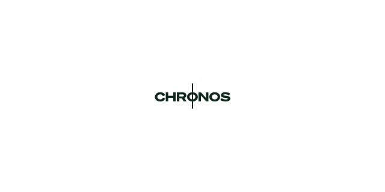

  <h1>nogen - chronos</h1>
  
A small menubar app for telling time in a different time zone.

  
   
   
  
If the app has has helped you, please consider giving it a ⭐️

_chronos_ is a small menubar app written in Swift to display a second clock on the macOS menubar. It provides at-a-glance access to the time in a timezone of your choosing.

## Why?

With remote working becoming more frequent by the minute, it is more likely that you find yourself living and working in two different time zones. This brings a lot of challenges with it, one of which is keeping track of time in both of the time zones.

When you are working with servers or databases that are using a timestamp that does not align with the clock in your status bar, it can be quite difficult to ad-hoc calculate the right time to find what you are looking for.

The idea came up one day when I was looking for an entry in a database that should have arrived a couple of minutes ago, however nothing had arrived for the couple of hours (which would not be unusual). It took me a full 10 minutes to realise that I had been an hour off in my time conversion, and the logs I were looking for were the ones from hours ago.

That is why I decided to create this app - to have a second clock showing in the menubar so that I could have at-a-glance access to the time in a different time zone.

## Installation

### GitHub Releases

As this is just an OSS projects, the app is not signed which means macOS will complain when trying to open it.
To open the application, right-click on the downloaded app and select open. This should allow you to open it. A simple double-click will not.

[Download the latest release](https://github.com/nogen-app/chronos/releases/latest/download/Chronos.app.zip)
